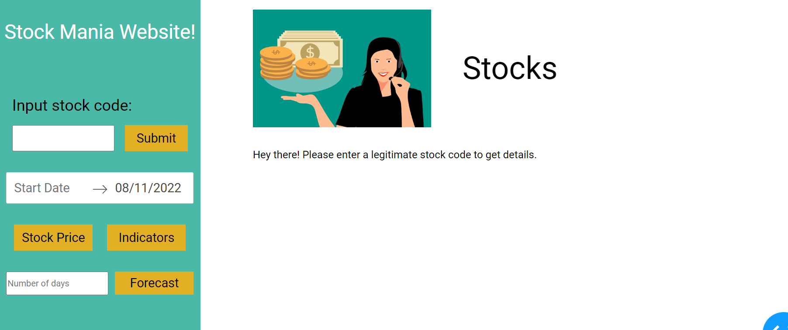
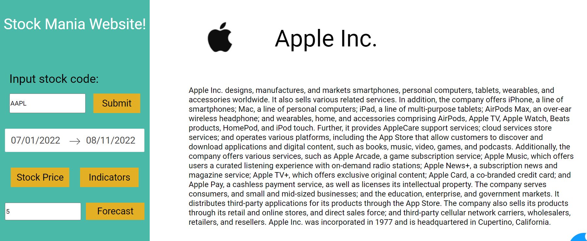
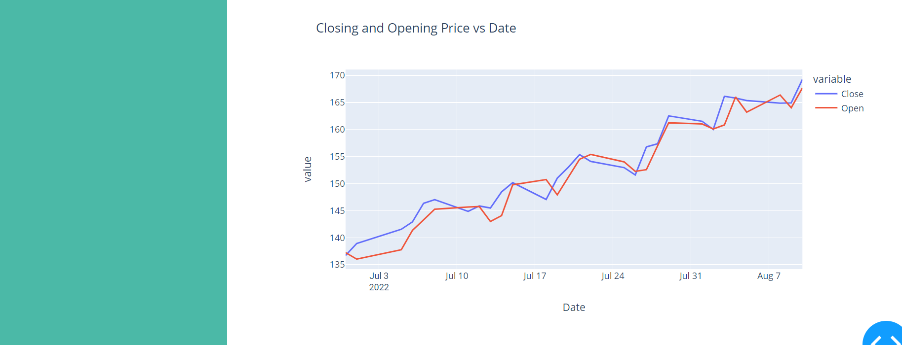
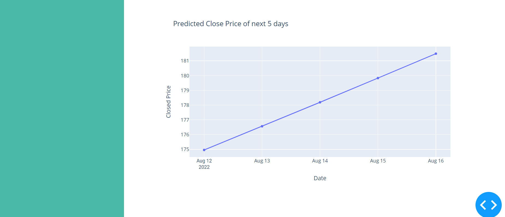

# Stock-Mania

💹 Stock investments provide one of the highest returns in the market. Even though they are volatile in nature, one can visualize share prices and other statistical factors which helpsthe keen investors carefully decide on which company they want to spend their earnings on.

### We develop this simple project idea by creating :

:star: A web application using Dash (a python framework) and some machine learning models which will show company information (logo, registered name and description) and stock plots based on the stock code given by the user. 

:star: Also the ML model will enable the user to get predicted stock prices for the date entered by the user.

Steps to use web application:

* Input stock code to get company information 
* Select date range to get stock price and estimated moving average plots
* Input number of days to get forecast

Output will be displayed.

### *Convention followed :*

* app.py - contains web layout and server function.(our main file).
* model.py - implemented a machine learning model for forecasting the stock price.
* The assets folder - is where we keep our CSS files for styling and any other miscellaneous files like images.
* requirements.txt - contains correct versions of the required Python packages to run our Python code.

***Libraries used***

1. numpy library is used for multi-dimensional array operations.
2. pandas is used for creating DataFrames to efficiently manage the data.
3. yfinance is a library that allows us to fetch financial data of a company (since its listing in the stock market) from its stock code directly.
4. sklearn and scikit-learn are tools used in the development of Machine Learning (ML) models.

💠 The basic layout of the application will be built using Dash (Dash HTML Components and Dash Core Components)

💠 Styling the application's web page using CSS and Flex.

💠 yfinance python library is used to get company information (name, logo and description) and stock price history. Dash's callback functions will be used to trigger updates based on change in inputs.

💠 Plotly library is used to generate the plots.

💠 The support vector regression (SVR) module from the sklearn library is used to build the ML model.

✔️ *To run your Dash app's server locally - $python app.py*

### Our website looks like :

----

On entering code and other inputs we obtain output :

----

----

-----
